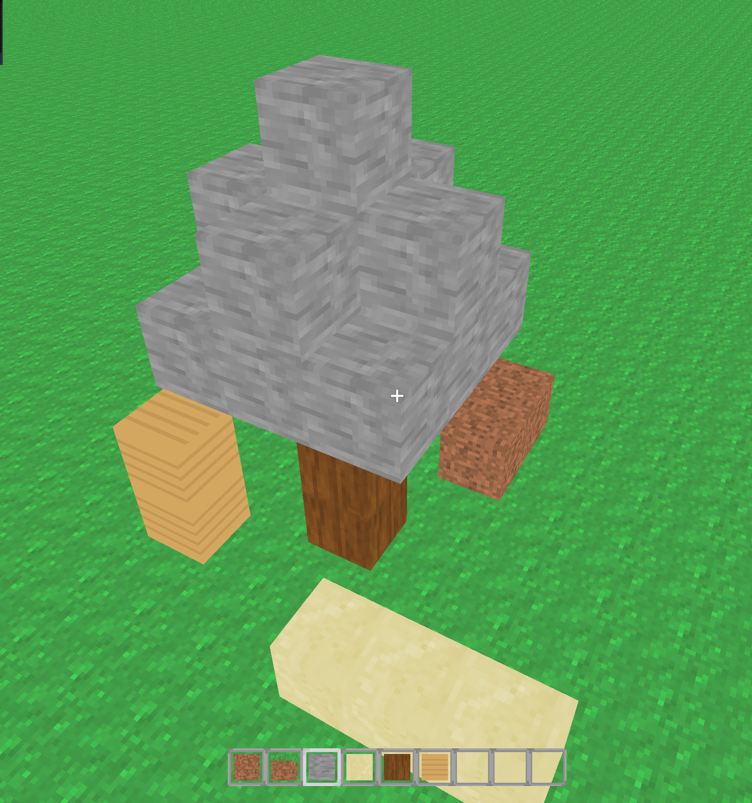

# Minecraft
This is a Minecraft clone, made with recreational intended purposes.



Building
-----
Currently, this is only tested for macOS. To build on macOS, run
```
make run
```
Which will build the executable file in the `bin` folder.

Current Implemented Features
-----
Features that are implemented include:
* Movement
* Placing and blocks
* Removing blocks
* Hotbar

Libraries Used
-----
* [OpenGL](https://www.opengl.org/) graphics rendering
* [GLFW](https://www.glfw.org/) utility library for OpenGL
* [GLM](https://github.com/g-truc/glm) for OpenGL mathematics
* [imgui](https://github.com/ocornut/imgui) for GUI
* [stb image](https://github.com/nothings/stb/tree/master) for images

Issues and Fixes
-----
Path: `/Library/Developer/CommandLineTools/SDKs/MacOSX.sdk/System/Library/Frameworks/Carbon.framework/Headers/Carbon`
Update glfw path: `cmake -D CMAKE_OSX_SYSROOT=/Library/Developer/CommandLineTools/SDKs/MacOSX.sdk`

TODO
-----
* Major refactor
    * Change all method names to CamelCase
    * Refactor `ChunkMesh`
        * Remove `model` matrix

    * (MAYBE) Make `mc` namespace because Block class is SLOW AF
    * Refactor block
    * Refactor ChunkMesh meshing
    * Refactor how the hotbar and crosshair are being rendered
    * Use a hashmap for block meshes
    * Move ui rendering to renderer
* Store the block data in a struct instead of a class because it is faster (array of structs vs array of pointers)
* Store the block data in bits of `uint64_t` for cpu communication bottleneck
* Chunks rendering as player moves around
* Physics
* Padding issues, add `-Wpadded` to see
    * See [this article](http://www.catb.org/esr/structure-packing/#_who_should_read_this)
